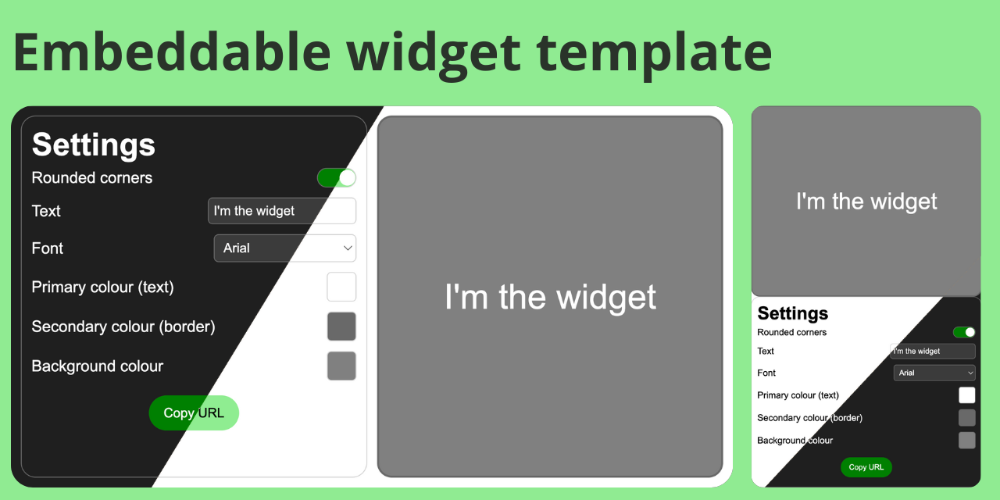

<h1 align="center">Embeddable Widget Template</h1>
<p align="center">Template for customisable and embeddable widget</p>



## Features
- **Simple respontive widget** (contains text)
- **[Responsive customisation interface](https://ozeily.github.io/embeddable-widget-template/)**
    - Rounded corners on/off (toggle switch)
    - Text input
    - Font selection
    - Colour pickers (text, background, border)
    - Light and dark themes depending on the user's device theme
    - Mobile mode (30em breakpoint)
- **Embed handler**

## Project structure
```bash
├── Embeddable widget template
│   ├── widget
│   │   ├── widget.css      # widget style sheet
│   │   ├── widget.html     # widget structure
│   │   ├── widget.js       # widget code
├── index.html              # interface structure
├── README.md               # repository presentation
├── script.js               # interface code
└── style.css               # interface style sheet
```
No additional file should be needed for your project. Edit the right file to add/edit anything. <br>
If you want to rename the files, do not forget to change the HTML files head.

In all the HTML files, the `defer` attribute in the `<script>` tag is used to make the .js files execute after the page has finished parsing (all the DOM content is loaded). Removing it is not recommended.

> [!CAUTION]
> Please read the comments in the `.js` files. It is necessary to understand my code (if you don't already do), and to know what you should edit or not.<br>
> `//DO NOT REMOVE` : you musn't edit or remove the block of code (function, event listener, etc.), unless you know what you're doing. <br>
> `//DO NOT EDIT` : you can edit it to add code, but you cannot edit or remove the existing one, unless you know what you're doing. <br>
> `// add ...` : add code according to your widget features.  <br>
> `//edit to your liking` : edit a specific part of the code to your liking. <br>
> Keep the id and classes of the HTML elements when editing the files. Use the same ones, or edit them in all the files. <br>